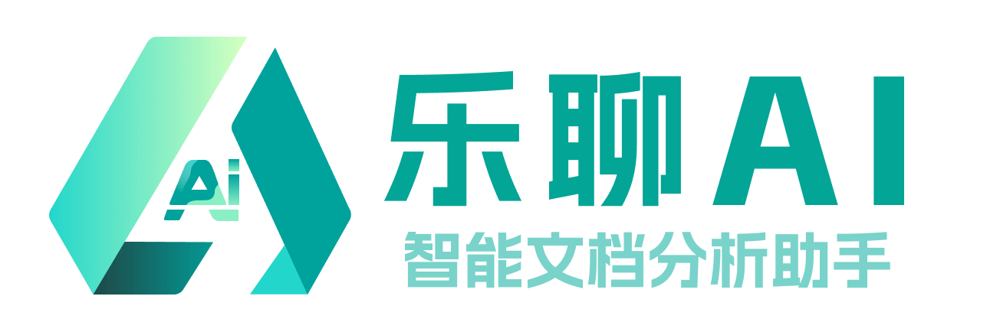
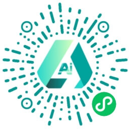
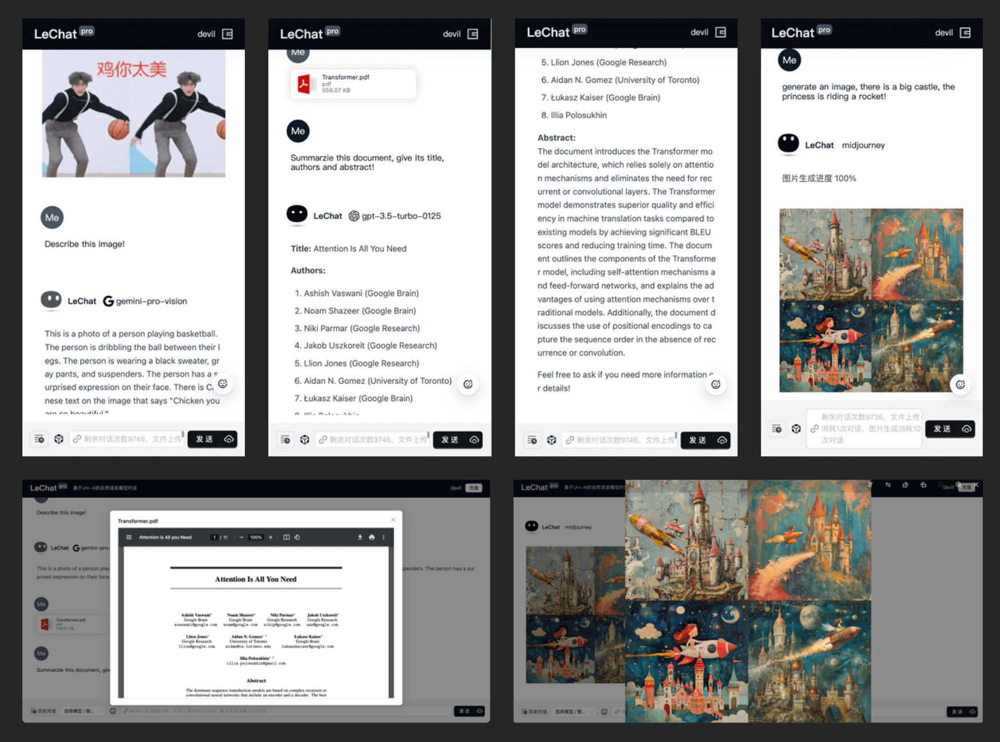

<!-- @format -->

<p align="center"></p>

<h1 align="center">UniAI</h1>

<h3 align="center">统一 AI 模型！</h3>

<p align="center">🤗 我们不生产模型，我们只是模型的搬运工！</p>

<h3 align=center>聊天</h3>


<h3 align=center>生图</h3>

<table>
    <tr>
        <td colspan="3"><strong>Prompt:</strong> 粉色连衣裙，糖果，短发，金发，刘海，额头，红色口红，长手套，发饰，高跟鞋，交叉双腿，高椅子，鸡尾酒，拿着鸡尾酒杯，通过玻璃看。</td>
    </tr>
    <tr>
        <td colspan="3"><strong>Negative Prompt:</strong> EasyNegative, badhandv4, badv5, aid210, aid291。</td>
    </tr>
    <tr>
        <td width="33.3%"><strong>MidJourney</strong></td>
        <td width="33.3%"><strong>Stability v1.6</strong></td>
        <td width="33.3%"><strong>OpenAI DALL-E-3</strong></td>
    </tr>
    <tr>
        <td width="33.3%"></td>
        <td width="33.3%"></td>
        <td width="33.3%"></td>
    </tr>
</table>

<h3 align=center>简单易用</h3>

```typescript
import UniAI from 'uniai'
// 填写所需模型的配置
const ai = new UniAI({ OpenAI: { key: '您的密钥', proxy: '您的代理 API' } })
// 聊天模型
const chat = await ai.chat('你好，世界')
// 表征向量模型
const embedding = await ai.embedding('你好，世界')
// 生图模型
const task = await ai.imagine('一只熊猫正在吃竹子')
// 查看生图任务，获取生成的图片
const image = await ai.task(task.taskId)
// 修改图片，仅支持 MidJourney，返回新任务 ID
const task2 = await ai.change('midjourney', task.taskId, 'UPSCALE', 4)
```

[🇺🇸 English Readme](./README.md) · 中文

## 已支持模型

<p>


</p>

最新更新：我们已支持 **OpenAI 的 O1** 和 **DeepSeek** 模型！

- [DeepSeek](https://api-docs.deepseek.com/)
- [OpenAI/GPT](https://platform.openai.com)
- [Google/Gemini](https://makersuite.google.com/app/)
- [科大讯飞/星火](https://xinghuo.xfyun.cn)
- [清华大学/ChatGLM](https://github.com/THUDM/ChatGLM4)
- [智谱/GLM3-4](https://open.bigmodel.cn)
- [月之暗面/MoonShot](https://platform.moonshot.cn/docs)
- [阿里云/千问](https://help.aliyun.com/zh/model-studio)
- [百度/文心千帆](https://cloud.baidu.com/product/wenxinworkshop)
- [OpenAI/DALL-E](https://platform.openai.com)
- [X AI Grok](https://docs.x.ai/docs/overview)
- [MidJourney Proxy](https://github.com/novicezk/midjourney-proxy)
- [Stability AI](https://platform.stability.ai/docs/getting-started)

## 基于 UniAI 开发的应用

我们使用 **UniAI** 开发了一些示例应用，欢迎体验并支持我们：

<div align=center>



<br>

</div>

## 安装

**使用 yarn：**

```bash
yarn add uniai
```

**使用 npm：**

```bash
npm install uniai --save
```

## 示例

我们为您编写了一些简单的调用示例，放置在 [examples](./example/) 文件夹中。您可以直接阅读示例文件来了解如何使用 **UniAI**。

您也可以继续阅读本文档，了解如何使用 **UniAI**。

您可以参考 [.env.example](./.env.example) 文件设置环境变量。

### PE树和碎片化提示词 [新功能]

您可以使用 `Prompt` 类构建分层的 Prompt 树，并自动生成 Markdown。这对于组织结构化的 Prompt 或文档非常有用。

**示例：**

```typescript
import { Prompt } from 'uniai'

const prompt = new Prompt('机器人信息', '这是一个简单的机器人。')
prompt.add(new Prompt('技能', '英语, 中文'))
prompt.add(new Prompt('简介', '年龄: 18\n性别: 男'))

console.log(prompt.toString())
```

**输出 Markdown：**

```
# 机器人信息

这是一个简单的机器人。

## 技能

英语, 中文

## 简介

年龄: 18
性别: 男
```

### 列出支持的模型

您可以使用 `.models` 列出 UniAI 中所有可用的模型。

**TypeScript 和 JavaScript ES6+**

```typescript
import UniAI from 'uniai'

const ai = new UniAI()
console.log(ai.models)
```

**JavaScript ES5**

```javascript
const UniAI = require('uniai').default

const ai = new UniAI()
console.log(ai.models)
```

**输出**

```json
[
    {
        "provider": "OpenAI",
        "value": "openai",
        "models": ["gpt-3.5-turbo", "gpt-4o", "chatgpt-4o-latest", "gpt-4o-mini", "gpt-4-turbo", "gpt-4"]
    }
    // ...其他提供商和模型
]
```

### 模型聊天

要与模型交互，请使用 `.chat()`，并在初始化 `new UniAI()` 时提供 **必需的 API 密钥** 或 **代理参数**。

默认模型是 **OpenAI/gpt-4o**，请提供 _OpenAI 密钥_ 和您的 _代理 API_。

```typescript
const key: string | string[] = '您的 OpenAI 密钥（必填），支持多密钥轮询'
const proxy = '您的 OpenAI API 代理（可选）'
const uni = new UniAI({ OpenAI: { key, proxy } })
const res = await uni.chat()
console.log(res)
```

**输出**

```json
{
    "content": "我是 OpenAI 的语言模型，训练有素，可以帮助提供信息。",
    "model": "gpt-3.5-turbo-0613",
    "object": "chat.completion",
    "promptTokens": 20,
    "completionTokens": 13,
    "totalTokens": 33
}
```

**带图聊天**

```js
const input = [
    {
        role: 'user',
        content: '描述这张图片',
        img: 'https://img2.baidu.com/it/u=2595743336,2138195985&fm=253&fmt=auto?w=801&h=800'
    }
]
// 注意：如果选择非图像模型，img 属性将被忽略！
const res = await ai.chat(input, { model: 'gpt-4o' })
console.log(res)
```

**输出**

```json
{
    "content": "这张图片展示了一位女性，她正站在镜子前用手机自拍...",
    "model": "gpt-4-1106-vision-preview",
    "object": "chat.completion",
    "promptTokens": 450,
    "completionTokens": 141,
    "totalTokens": 591
}
```

### 流式聊天

对于流式聊天，响应是一个 JSON Buffer。

以下是与 Google gemini-pro 进行流式聊天的示例。

```typescript
const key: string | string[] = '您的 Google 密钥（必填），支持多密钥轮询'
const proxy = '您的 Google API 代理（可选）'
const uni = new UniAI({ Google: { key, proxy } })
const res = await uni.chat(input, { stream: true, provider: ModelProvider.Google, model: GoogleChatModel.GEM_PRO })
const stream = res as Readable
let data = ''
stream.on('data', chunk => (data += JSON.parse(chunk.toString()).content))
stream.on('end', () => console.log(data))
```

**输出（流式）**

```
Google 训练的语言模型，为您提供服务。
```

## 运行测试

UniAI 使用 `jest` 运行所有支持模型的单元测试。

```bash
yarn test
```

如果要运行特定模型提供商的单元测试：

```bash
# OpenAI, Google, Baidu, IFlyTek, MoonShot, GLM, Other, Imagine...
yarn test OpenAI
```

## 致谢

[中科苏州智能计算技术研究院](http://iict.ac.cn/)

## 贡献者

[Youwei Huang](https://www.devil.ren)

[Weilong Yu](https://github.com/mrkk1)

## 谁在使用

|                          项目                          |                              简介                               |
| :----------------------------------------------------: | :-------------------------------------------------------------: |
| [UniAI MaaS](https://github.com/uni-openai/uniai-maas) | UniAI 是一个统一的 API 平台，旨在简化与多种复杂 AI 模型的交互。 |
|   [乐聊](https://github.com/CAS-IICT/lechat-uniapp)    |           基于大语言模型的文档分析与对话微信小程序。            |
|         [LeChat Pro](https://lechat.cas-ll.cn)         |         基于 UniAI 的全平台客户端，多模型流式对话平台。         |

## Star 历史

[](https://star-history.com/#devilyouwei/UniAI&Timeline)

## 许可证

[MIT](./LICENSE)
